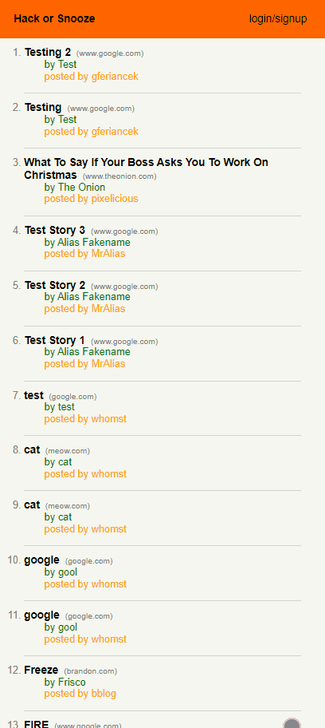

# hack-or-snooze

Hack or Snooze is a clone of Hacker News using the [Hack or Snooze API](https://hackorsnoozev3.docs.apiary.io/#reference/0/story/delete-a-story). It allows a user to create / login to an account, view and favorite news stories posted by all users, as well as create and delete their own news stories.

## Technologies / Topics Covered

- AJAX and Axios (GET / POST / DELETE)
- Error Handling
- jQuery / JavaScript / HTML / SCSS / CSS

## UI

<table>
  <thead>
    <tr>
      <th>Mobile</th>
      <th>Desktop</th>
    </tr>
  </thead>
  <tbody>
    <tr>
      <td></td>
      <td></td>
    </tr>
  </tbody>
</table>
